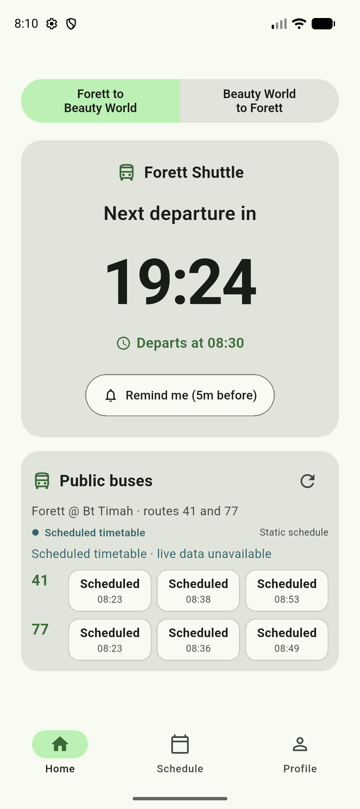

# Forett Shuttle

Forett Shuttle is a Flutter app for checking the Forett Condo shuttle between
Forett and Beauty World, with live public-bus arrival predictions for routes 41
and 77.

The primary validation target is an Android Pixel device. The schedule uses the
`Asia/Singapore` time zone and runs Monday through Saturday.

## Preview

<p align="center">
  
</p>

The Android emulator preview shows the Home screen at 08:10 Singapore time,
with the next shuttle departure at 08:30 and the scheduled public-bus fallback.

## Features

- Shuttle countdown with the exact departure time.
- Direction-aware shuttle schedule for both routes.
- Next-service information after the last shuttle and on Sundays.
- Live ETA predictions for public buses 41 and 77.
- User-configured trip cards with independent outbound/return directions,
  multiple bus legs, and saved transfer points.
- A clearly labelled scheduled timetable fallback when live data is unavailable.
- Optional five-minute shuttle reminders using native Android alarms or Web
  Push from an installed PWA.
- Light and dark themes, restored on startup together with the main direction.

## Architecture

- `lib/schedule.dart` contains the shuttle timetable and Singapore time-zone
  calculations.
- `lib/notifications.dart` is the shared notification facade; conditional
  native and Web backends contain exact-alarm and Web Push handling.
- `lib/bus_arrivals.dart` contains the live ETA client and static fallback.
- `lib/trip_cards.dart` contains the versioned local trip-card model and
  persistence controller; `lib/screens/trip_cards_screen.dart` contains the
  editor and reorderable settings list.
- `lib/screens/` contains the Home, Schedule, and Profile screens.
- `worker/` contains the existing protected transport Worker and a separate Web
  entrypoint for static assets, the same-origin proxy, D1 reminders and Queue
  delivery.

The Flutter app talks only to the HTTPS Worker. LTA credentials stay in
Cloudflare Worker secrets and are never shipped in the app.

## Privacy

The public privacy policy for the Android app is maintained at
[`docs/privacy/index.html`](docs/privacy/index.html). When GitHub Pages is
enabled for this repository, publish the `docs/` folder from the default branch
and use the resulting `/privacy/` URL in Google Play Console.

## Run the Flutter app

Install Flutter and Android tooling, then install dependencies:

```bash
flutter pub get
```

For live arrivals, create a local environment file from the checked-in example:

```bash
cp .bus_api.env.example .bus_api.env
```

Set the Worker URL and the app key in `.bus_api.env`, then run or build with the
file:

```bash
flutter run --dart-define-from-file=.bus_api.env
flutter build apk --debug --dart-define-from-file=.bus_api.env
```

`.bus_api.env` is ignored by Git. Do not commit it, paste its values into source
files, or include it in an issue, screenshot, APK, or log.

Without the local define file, the app remains usable with the bundled scheduled
fallback for routes 41 and 77.

## Build the Web app

The Web build intentionally does not use `.bus_api.env`. It calls `/api` on the
site origin, while the Web Worker holds the transport credential.

```bash
./tool/build_web.sh
```

This creates a standard JavaScript Flutter release, injects the generated asset
list into the single offline/push service worker and rejects output containing
secret-name markers. See [`WEB_DEPLOYMENT.md`](WEB_DEPLOYMENT.md) for test and
production Cloudflare setup. Installation, help and Web privacy pages are part
of the same build at `/install.html`, `/help.html` and `/privacy.html`.

## Deploy the Worker

From `worker/`:

```bash
npm ci
npx wrangler login
npx wrangler secret put LTA_ACCOUNT_KEY
npx wrangler secret put APP_API_KEY
npx wrangler deploy
```

The Worker preserves the legacy direction-based 41/77 arrival endpoint and
also accepts five-digit stop codes for custom cards. Place search, stop search
and bus-only OneMap trip planning require the same app authentication. Configure `ONEMAP_TOKEN` as a
Worker secret when route search is enabled; never put secret values in
`wrangler.toml`, source code, tests, or Git history.

The Web Worker uses its own deployment configuration. Copy
`worker/wrangler.web.toml.example` to the ignored `worker/wrangler.web.toml`
only after creating separate D1 and Queue resources. The checked-in migration
is `worker/migrations/0001_web.sql`.

## Validation

```bash
dart format --output=none --set-exit-if-changed lib test integration_test
flutter analyze
flutter test
cd worker && npm ci && npm test && npm run typecheck
```

For Android validation, build and install the regular debug APK after any
integration-test run so the device does not retain a test entrypoint:

```bash
flutter build apk --debug --dart-define-from-file=.bus_api.env
adb -s <device-id> install -r build/app/outputs/flutter-apk/app-debug.apk
```

## Security notes

- `APP_API_KEY` is an access-control credential for the Worker, not proof that
  an APK is trusted; mobile app values can be extracted.
- `LTA_ACCOUNT_KEY` must exist only as a Worker secret.
- Local environment files, signing keys, keystores, certificates, APKs, and
  generated build output are excluded by `.gitignore`.
- Before making a repository public, inspect both the working tree and Git
  history for credentials, private keys, personal data, and local configuration.

## Trip card display and timing

Cards keep both saved directions, their order and selection locally. The short
card name labels the destination switch; the address remains in the editor.
Home shows the first bus and the service sequence, with stops and walks in
**Route details**. Edit a card to **Find alternatives**, then confirm with Save.
Legacy operator-prefixed service labels are normalized when cards load.

Stop snapshots are shared for 20 seconds; upstream data older than 60 seconds
is stale. Bus selection includes the initial walk and a two-minute transfer
buffer. If an older card lacks leg durations, the app shows stop predictions
without claiming the connection is reachable or inventing a destination ETA.
Choose a new route in the editor to obtain leg durations. No scheduled fallback
is generated for custom stop/service combinations.

OneMap routing uses an expiring Worker secret `ONEMAP_TOKEN`. Automatic token
renewal is not implemented. The current stop search scans a limited LTA catalogue
and route editing does not yet validate service/stop sequence against BusRoutes.
Later connections outside LTA's prediction window show unavailable estimates;
there is no automatic re-planning of the saved route.
